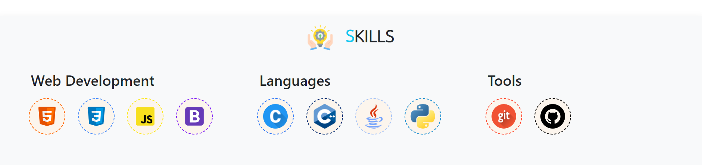
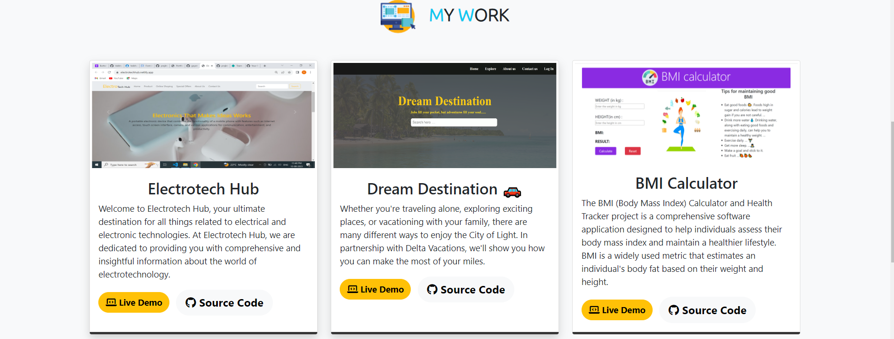

# PORTFOLIO

  A portfolio is a compilation of materials that exemplifies your beliefs, skills, qualifications, education, training, and experiences.

HOME

SKILL

SOURCE CODE

[https://github.com/gayatrisathawane/alterportfolio](https://github.com/gayatrisathawane/alterportfolio)

LIVE DEMO

[https://gayatriportfolio2.netlify.app/](https://gayatriportfolio2.netlify.app/)